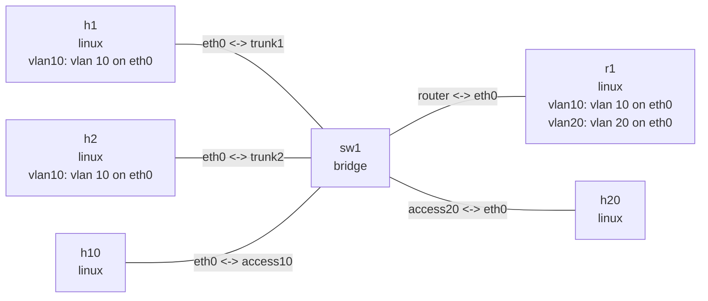

# VLAN

One `nslab.yaml` demonstrates two common VLAN uses in one connected topology. `h1` and `h2` use
VLAN 10 subinterfaces on tagged trunk ports, `h10` uses a VLAN 10 access port, and `r1` provides
VLAN 10 and VLAN 20 subinterfaces over one trunk. This lets you verify same-VLAN Layer 2
connectivity first, then inter-VLAN Layer 3 forwarding through `r1`.

## Topology

```bash
nslab graph --format mermaid
```



The outputs below are representative. Interface indexes, MAC addresses, and timings vary.

## Deploy

```console
$ cd examples/vlan

$ sudo nslab deploy
deployed topology: vlan

$ sudo nslab inspect
status: deployed

NAME  KIND    STATUS    NAMESPACE
----  ------  --------  ----------------------------
h1    linux   matching  nslab-vlan-h1-...
h2    linux   matching  nslab-vlan-h2-...
h10   linux   matching  nslab-vlan-h10-...
sw1   bridge  matching  nslab-vlan-sw1-...
r1    linux   matching  nslab-vlan-r1-...
h20   linux   matching  nslab-vlan-h20-...
```

## VLAN subinterfaces

`h1` and `h2` connect to `sw1` ports `trunk1` and `trunk2`. Their lower `eth0` devices carry
tagged frames, while IPv4 addresses exist only on `vlan10`:

```console
$ sudo nslab exec --node h1 -- ip -d link show vlan10
<index>: vlan10@eth0: <BROADCAST,MULTICAST,UP,LOWER_UP> mtu 1500 ... state UP ...
    link/ether <mac> brd ff:ff:ff:ff:ff:ff
    vlan protocol 802.1Q id 10 <REORDER_HDR>

$ sudo nslab exec --node h1 -- ip -4 address show vlan10
<index>: vlan10@eth0: <BROADCAST,MULTICAST,UP,LOWER_UP> ...
    inet 192.168.10.3/24 scope global vlan10

$ sudo nslab exec --node h1 -- ip -4 route show
192.168.10.0/24 dev vlan10 proto kernel scope link src 192.168.10.3
default via 192.168.10.1 dev vlan10

$ sudo nslab exec --node h1 -- ping -c 3 192.168.10.4
PING 192.168.10.4 (192.168.10.4) 56(84) bytes of data.
64 bytes from 192.168.10.4: icmp_seq=1 ttl=64 time=<time> ms
...
3 packets transmitted, 3 received, 0% packet loss
```

`vlan10@eth0` identifies `eth0` as the lower device. `id 10` is the 802.1Q VLAN ID matched on
receive and inserted on transmit. `h1` and `h2` share the VLAN 10 Layer 2 domain through `sw1`.

## Router on a stick

The `access10` and `access20` ports remove tags toward the hosts. `trunk1`, `trunk2`, and
`router` keep VLAN 10 tags; `router` also carries VLAN 20. `r1` routes between its two VLAN
subinterfaces:

```console
$ sudo nslab exec --node sw1 -- bridge vlan show
port      vlan-id
trunk1    10
trunk2    10
access10  10 PVID Egress Untagged
router    10
          20
access20  20 PVID Egress Untagged

$ sudo nslab exec --node r1 -- ip -d link show type vlan
<index>: vlan10@eth0: <BROADCAST,MULTICAST,UP,LOWER_UP> ...
    vlan protocol 802.1Q id 10 <REORDER_HDR>
<index>: vlan20@eth0: <BROADCAST,MULTICAST,UP,LOWER_UP> ...
    vlan protocol 802.1Q id 20 <REORDER_HDR>

$ sudo nslab exec --node r1 -- ip -4 route show
192.168.10.0/24 dev vlan10 proto kernel scope link src 192.168.10.1
192.168.20.0/24 dev vlan20 proto kernel scope link src 192.168.20.1

$ sudo nslab exec --node r1 -- cat /proc/sys/net/ipv4/ip_forward
1

$ sudo nslab exec --node h10 -- ip -4 route show
default via 192.168.10.1 dev eth0
192.168.10.0/24 dev eth0 proto kernel scope link src 192.168.10.2

$ sudo nslab exec --node h1 -- ping -c 3 192.168.20.2
PING 192.168.20.2 (192.168.20.2) 56(84) bytes of data.
64 bytes from 192.168.20.2: icmp_seq=1 ttl=63 time=<time> ms
...
3 packets transmitted, 3 received, 0% packet loss
```

TTL 63 confirms one IPv4 forwarding hop through `r1`.

## Clean up

```console
$ sudo nslab destroy
destroyed topology: vlan
```

[View nslab.yaml](https://github.com/calcky/nslab/blob/main/examples/vlan/nslab.yaml) ·
[View example README](https://github.com/calcky/nslab/blob/main/examples/vlan/README.md)
