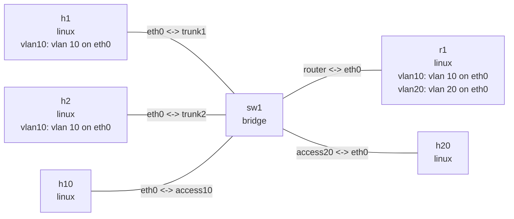

# VLAN

一个 `nslab.yaml` 在同一个连通拓扑中演示两种常见 VLAN 用法。`h1`、`h2` 使用 VLAN 10
子接口接入 tagged trunk，`h10` 使用 VLAN 10 access 端口，`r1` 通过一条 trunk 提供
VLAN 10/20 子接口。这样可以先验证同 VLAN 二层互通，再验证经过 `r1` 的跨 VLAN 三层转发。

## 拓扑图

```bash
nslab graph --format mermaid
```



以下输出中的接口索引、MAC 地址和 ICMP 时延会随运行变化。

## 运行

```console
$ cd examples/vlan

$ sudo nslab deploy
deployed topology: vlan

$ sudo nslab inspect
status: deployed

NAME  KIND    STATUS    NAMESPACE
----  ------  --------  ----------------------------
h1    linux   matching  nslab-vlan-h1-...
h2    linux   matching  nslab-vlan-h2-...
h10   linux   matching  nslab-vlan-h10-...
sw1   bridge  matching  nslab-vlan-sw1-...
r1    linux   matching  nslab-vlan-r1-...
h20   linux   matching  nslab-vlan-h20-...
```

## VLAN 子接口直连

`h1` 和 `h2` 接入 `sw1` 的 `trunk1`、`trunk2`。底层 `eth0` 承载带 tag 的帧，IPv4 地址
只配置在 `vlan10` 上：

```console
$ sudo nslab exec --node h1 -- ip -d link show vlan10
<index>: vlan10@eth0: <BROADCAST,MULTICAST,UP,LOWER_UP> mtu 1500 ... state UP ...
    link/ether <mac> brd ff:ff:ff:ff:ff:ff
    vlan protocol 802.1Q id 10 <REORDER_HDR>

$ sudo nslab exec --node h1 -- ip -4 address show vlan10
<index>: vlan10@eth0: <BROADCAST,MULTICAST,UP,LOWER_UP> ...
    inet 192.168.10.3/24 scope global vlan10

$ sudo nslab exec --node h1 -- ip -4 route show
192.168.10.0/24 dev vlan10 proto kernel scope link src 192.168.10.3
default via 192.168.10.1 dev vlan10

$ sudo nslab exec --node h1 -- ping -c 3 192.168.10.4
PING 192.168.10.4 (192.168.10.4) 56(84) bytes of data.
64 bytes from 192.168.10.4: icmp_seq=1 ttl=64 time=<time> ms
...
3 packets transmitted, 3 received, 0% packet loss
```

`vlan10@eth0` 表示 `eth0` 是 lower device；`id 10` 是接收时匹配、发送时插入的
802.1Q VLAN ID。`h1` 和 `h2` 通过 `sw1` 的 VLAN 10 二层域互通。

## Router-on-a-stick

`access10` 和 `access20` 端口向主机发送 untagged 帧，`trunk1`、`trunk2` 和 `router` 保留
VLAN 10 的 tag；`router` 还承载 VLAN 20，`r1` 通过两个 VLAN 子接口完成三层转发：

```console
$ sudo nslab exec --node sw1 -- bridge vlan show
port      vlan-id
trunk1    10
trunk2    10
access10  10 PVID Egress Untagged
router    10
          20
access20  20 PVID Egress Untagged

$ sudo nslab exec --node r1 -- ip -d link show type vlan
<index>: vlan10@eth0: <BROADCAST,MULTICAST,UP,LOWER_UP> ...
    vlan protocol 802.1Q id 10 <REORDER_HDR>
<index>: vlan20@eth0: <BROADCAST,MULTICAST,UP,LOWER_UP> ...
    vlan protocol 802.1Q id 20 <REORDER_HDR>

$ sudo nslab exec --node r1 -- ip -4 route show
192.168.10.0/24 dev vlan10 proto kernel scope link src 192.168.10.1
192.168.20.0/24 dev vlan20 proto kernel scope link src 192.168.20.1

$ sudo nslab exec --node r1 -- cat /proc/sys/net/ipv4/ip_forward
1

$ sudo nslab exec --node h10 -- ip -4 route show
default via 192.168.10.1 dev eth0
192.168.10.0/24 dev eth0 proto kernel scope link src 192.168.10.2

$ sudo nslab exec --node h1 -- ping -c 3 192.168.20.2
PING 192.168.20.2 (192.168.20.2) 56(84) bytes of data.
64 bytes from 192.168.20.2: icmp_seq=1 ttl=63 time=<time> ms
...
3 packets transmitted, 3 received, 0% packet loss
```

TTL 从 64 变为 63，说明报文经过了 `r1` 的一次 IPv4 转发。

## 清理

```console
$ sudo nslab destroy
destroyed topology: vlan
```

[查看 nslab.yaml](https://github.com/calcky/nslab/blob/main/examples/vlan/nslab.yaml) ·
[查看示例 README](https://github.com/calcky/nslab/blob/main/examples/vlan/README.md)
