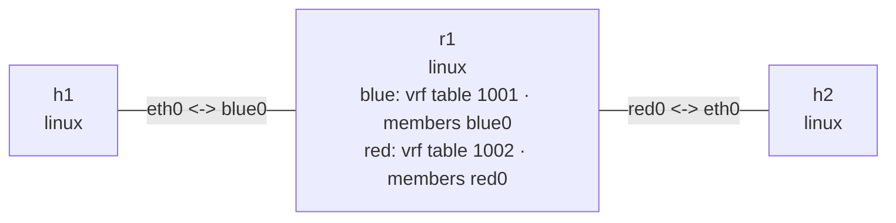

# Linux VRF

## Goal

Create two VRF devices in one `r1` namespace. Both sides use identical interface addresses,
next hops, and destination prefixes, while tables 1001 and 1002 keep the overlapping address
spaces isolated.

## Graph

```console
$ nslab graph --format mermaid
flowchart LR
    n0["h1\nlinux"]
    n1["r1\nlinux\nblue: vrf table 1001 · members blue0\nred: vrf table 1002 · members red0"]
    n2["h2\nlinux"]
    n0 -- "eth0 <-> blue0" --- n1
    n1 -- "red0 <-> eth0" --- n2
```



The outputs below are representative. Interface indexes, MAC addresses, and timings vary.

## Run

```console
$ cd examples/vrf

$ sudo nslab deploy
deployed topology: vrf

$ sudo nslab inspect
status: deployed

NAME  KIND   STATUS    NAMESPACE
----  -----  --------  --------------------
h1    linux  matching  nslab-vrf-h1-...
r1    linux  matching  nslab-vrf-r1-...
h2    linux  matching  nslab-vrf-h2-...
```

## Observe VRF membership

```console
$ sudo nslab exec --node r1 -- ip -d link show type vrf
<index>: blue: <NOARP,MASTER,UP,LOWER_UP> ... state UP ...
    vrf table 1001
<index>: red: <NOARP,MASTER,UP,LOWER_UP> ... state UP ...
    vrf table 1002

$ sudo nslab exec --node r1 -- ip -br link show master blue
blue0  UP  <mac> <BROADCAST,MULTICAST,UP,LOWER_UP>

$ sudo nslab exec --node r1 -- ip -br link show master red
red0   UP  <mac> <BROADCAST,MULTICAST,UP,LOWER_UP>
```

Both `blue0` and `red0` own `10.0.0.1/24`. Their VRF masters place the identical connected
prefixes in separate routing tables.

## Compare routing tables

```console
$ sudo nslab exec --node r1 -- ip -4 route show vrf blue
10.0.0.0/24 dev blue0 proto kernel scope link src 10.0.0.1
192.0.2.2 via 10.0.0.2 dev blue0 proto static

$ sudo nslab exec --node r1 -- ip -4 route show vrf red
10.0.0.0/24 dev red0 proto kernel scope link src 10.0.0.1
192.0.2.2 via 10.0.0.2 dev red0 proto static

$ sudo nslab exec --node r1 -- ip -4 route get 192.0.2.2
RTNETLINK answers: Network is unreachable
```

The unbound lookup uses the main table and fails. The two VRF lookups use the same destination
and next hop but select different member interfaces.

## Verify overlapping address spaces

```console
$ sudo nslab exec --node r1 -- ping -I blue -c 1 192.0.2.2
PING 192.0.2.2 (192.0.2.2) from 10.0.0.1 blue: 56(84) bytes of data.
64 bytes from 192.0.2.2: icmp_seq=1 ttl=64 time=<time> ms
1 packets transmitted, 1 received, 0% packet loss

$ sudo nslab exec --node r1 -- ping -I red -c 1 192.0.2.2
PING 192.0.2.2 (192.0.2.2) from 10.0.0.1 red: 56(84) bytes of data.
64 bytes from 192.0.2.2: icmp_seq=1 ttl=64 time=<time> ms
1 packets transmitted, 1 received, 0% packet loss
```

The blue command reaches `h1`; the red command reaches `h2`, despite using identical source and
destination addresses.

## Clean up

```console
$ sudo nslab destroy
destroyed topology: vrf
```

[View nslab.yaml](https://github.com/calcky/nslab/blob/main/examples/vrf/nslab.yaml) ·
[View example README](https://github.com/calcky/nslab/blob/main/examples/vrf/README.md)
