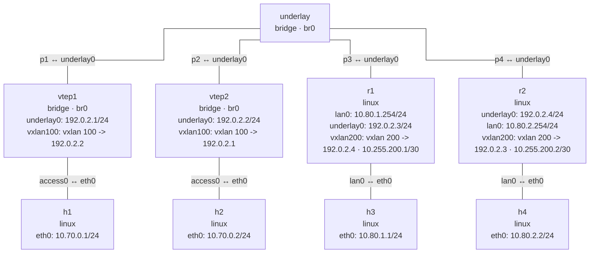

# VXLAN

This page uses one `nslab.yaml` to demonstrate two VXLAN data planes. A shared underlay bridge
connects four VTEPs: `vtep1` and `vtep2` provide a Layer 2 bridge overlay with VNI 100, while
`r1` and `r2` provide a standalone Layer 3 routed overlay with VNI 200. Both overlays are
deployed and destroyed together.

## Topology

```console
$ nslab graph --format mermaid
%%{init: {"flowchart": {"curve": "step"}}}%%
flowchart TB
    n0["h1\nlinux\neth0: 10.70.0.1/24"]
    n1["vtep1\nbridge · br0\nunderlay0: 192.0.2.1/24\nvxlan100: vxlan 100 -> 192.0.2.2"]
    n2["vtep2\nbridge · br0\nunderlay0: 192.0.2.2/24\nvxlan100: vxlan 100 -> 192.0.2.1"]
    n3["h2\nlinux\neth0: 10.70.0.2/24"]
    n4["h3\nlinux\neth0: 10.80.1.1/24"]
    n5["r1\nlinux\nlan0: 10.80.1.254/24\nunderlay0: 192.0.2.3/24\nvxlan200: vxlan 200 -> 192.0.2.4 · 10.255.200.1/30"]
    n6["r2\nlinux\nunderlay0: 192.0.2.4/24\nlan0: 10.80.2.254/24\nvxlan200: vxlan 200 -> 192.0.2.3 · 10.255.200.2/30"]
    n7["h4\nlinux\neth0: 10.80.2.2/24"]
    n8["underlay\nbridge · br0"]
    n8 -- "p1 ↔ underlay0" --- n1
    n8 -- "p2 ↔ underlay0" --- n2
    n8 -- "p3 ↔ underlay0" --- n5
    n8 -- "p4 ↔ underlay0" --- n6
    n1 -- "access0 ↔ eth0" --- n0
    n2 -- "access0 ↔ eth0" --- n3
    n5 -- "lan0 ↔ eth0" --- n4
    n6 -- "lan0 ↔ eth0" --- n7
```



## Deploy and inspect

```console
$ sudo nslab deploy
deployed topology: vxlan

$ sudo nslab inspect
status: deployed

NAME     KIND    STATUS    NAMESPACE
-------  ------  --------  ----------------------
h1       linux   matching  nslab-vxlan-h1-...
vtep1    bridge  matching  nslab-vxlan-vtep1-...
vtep2    bridge  matching  nslab-vxlan-vtep2-...
h2       linux   matching  nslab-vxlan-h2-...
h3       linux   matching  nslab-vxlan-h3-...
r1       linux   matching  nslab-vxlan-r1-...
r2       linux   matching  nslab-vxlan-r2-...
h4       linux   matching  nslab-vxlan-h4-...
underlay bridge  matching  nslab-vxlan-underlay-...
```

## Layer 2 bridge overlay

VNI 100 is attached to `br0` on both bridge VTEPs. Unknown frames use the static remote VTEP
FDB entry and reach the other host:

```console
$ sudo nslab exec --node vtep1 -- /usr/sbin/ip -d link show vxlan100
3: vxlan100: <BROADCAST,MULTICAST,UP,LOWER_UP> mtu 1450 ... master br0 state UNKNOWN ...
    vxlan id 100 remote 192.0.2.2 local 192.0.2.1 dev underlay0 ... dstport 4789 ...

$ sudo nslab exec --node vtep1 -- /usr/sbin/bridge fdb show dev vxlan100
00:00:00:00:00:00 dst 192.0.2.2 via underlay0 self permanent

$ sudo nslab exec --node h1 -- /usr/bin/ping -c 2 10.70.0.2
PING 10.70.0.2 (10.70.0.2) 56(84) bytes of data.
64 bytes from 10.70.0.2: icmp_seq=1 ttl=64 time=<time> ms
64 bytes from 10.70.0.2: icmp_seq=2 ttl=64 time=<time> ms
2 packets transmitted, 2 received, 0% packet loss
```

## Layer 3 routed overlay

VNI 200 is a standalone interface on `r1` and `r2`. It owns a tunnel address and routes between
the `10.80.1.0/24` and `10.80.2.0/24` LANs:

```console
$ sudo nslab exec --node r1 -- /usr/sbin/ip -d link show vxlan200
<index>: vxlan200: <BROADCAST,MULTICAST,UP,LOWER_UP> mtu 1450 ... state UNKNOWN ...
    vxlan id 200 local 192.0.2.3 remote 192.0.2.4 dev underlay0 ... dstport 4789

$ sudo nslab exec --node r1 -- /usr/sbin/ip -4 route show
10.80.1.0/24 dev lan0 proto kernel scope link src 10.80.1.254
10.80.2.0/24 via 10.255.200.2 dev vxlan200
10.255.200.0/30 dev vxlan200 proto kernel scope link src 10.255.200.1
192.0.2.0/24 dev underlay0 proto kernel scope link src 192.0.2.3

$ sudo nslab exec --node h3 -- /usr/bin/ping -c 1 -W 2 10.80.2.2
PING 10.80.2.2 (10.80.2.2) 56(84) bytes of data.
64 bytes from 10.80.2.2: icmp_seq=1 ttl=62 time=<time> ms
1 packets transmitted, 1 received, 0% packet loss
```

The `underlay` bridge carries only outer UDP traffic. `vxlan100` has a bridge master; `vxlan200`
has no bridge master and can carry an IP address directly. With a 1500-byte underlay, nslab
derives a 1450-byte MTU for both VXLAN interfaces.

```console
$ sudo nslab destroy
destroyed topology: vxlan
```

[View nslab.yaml](https://github.com/calcky/nslab/blob/main/examples/vxlan/nslab.yaml) ·
[View example README](https://github.com/calcky/nslab/blob/main/examples/vxlan/README.md)
