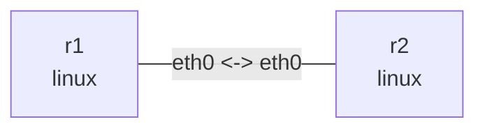

# Dual-stack WireGuard tunnel

Run in this directory with `wireguard-tools`, `iproute2`, `tcpdump`, `iputils-ping`, and kernel WireGuard support. The two-node veth carries the UDP underlay; setup.sh creates wg0 inside the namespaces. No wg-quick, systemd, or containers are needed.

## Topology and deployment

```bash
nslab graph --format mermaid
```



```console
$ sudo nslab deploy
deployed topology: wireguard
$ sudo nslab inspect
status: deployed
...
```

## Generate keys and configure

Run the script after deploy. Fresh keys are stored only in a private temporary directory and the files are removed on success or failure. Private keys remain in kernel interfaces until those interfaces are destroyed. The script refuses to overwrite wg0; redeploy before another run. Use NSLAB_NAME for a custom deployment and NSLAB_BIN for an absolute nslab binary path.

```console
$ sudo bash ./setup.sh
WireGuard configured: r1 <-> r2 (IPv4 + IPv6)
$ sudo nslab exec --node r1 -- ip addr show dev wg0
... wg0 ... mtu 1420 ...
    inet 10.80.0.1/32 ...
    inet6 fd80::1/128 ...
$ sudo nslab exec --node r1 -- wg show wg0
interface: wg0
  public key: <public-key>
  private key: (hidden)
  listening port: 51820
peer: <peer-public-key>
  endpoint: 192.0.2.2:51820
  allowed ips: 10.80.0.2/32, fd80::2/128
```

## Handshake and encrypted traffic

Capture r1:eth0 and r1:wg0 separately, then ping from another terminal. eth0 carries encrypted UDP while wg0 exposes plaintext ICMP. There may be no handshake immediately after setup; traffic triggers it. wg show hides private keys; avoid showconf/dump outputs that expose them.

```console
$ sudo nslab exec --node r1 -- tcpdump -ni eth0 'udp port 51820'
... 192.0.2.1.51820 > 192.0.2.2.51820: UDP, length ...
$ sudo nslab exec --node r1 -- tcpdump -ni wg0 'icmp or icmp6'
... 10.80.0.1 > 10.80.0.2: ICMP echo request ...
$ sudo nslab exec --node r1 -- ping -c 3 -W 2 10.80.0.2
...
3 packets transmitted, 3 received, 0% packet loss
$ sudo nslab exec --node r1 -- ping -6 -c 3 -W 2 fd80::2
...
3 packets transmitted, 3 received, 0% packet loss
$ sudo nslab exec --node r1 -- wg show wg0 latest-handshakes
<peer-public-key> <nonzero-unix-timestamp>
$ sudo nslab exec --node r1 -- wg show wg0 transfer
<peer-public-key> <received-bytes> <sent-bytes>
```

## AllowedIPs and routes

Routing first selects wg0, then AllowedIPs selects a peer by destination. On receive it also validates the decrypted source against that peer. wg set does not install Linux routes; the script explicitly adds /32 and /128 routes. Remove the correct AllowedIPs temporarily: ping fails despite an existing route, then restore them.

```bash
peer=$(sudo nslab exec --node r1 -- wg show wg0 peers)
```

```console
$ sudo nslab exec --node r1 -- wg set wg0 peer "$peer" allowed-ips 10.80.0.3/32
(no output)
$ sudo nslab exec --node r1 -- ip route get 10.80.0.2
10.80.0.2 dev wg0 src 10.80.0.1 ...
$ sudo nslab exec --node r1 -- ping -c 1 -W 2 10.80.0.2
... Required key not available ...
$ sudo nslab exec --node r1 -- wg set wg0 peer "$peer" allowed-ips 10.80.0.2/32,fd80::2/128
(no output)
$ sudo nslab exec --node r1 -- ping -c 2 -W 2 10.80.0.2
...
2 packets transmitted, 2 received, 0% packet loss
```

## MTU and cleanup

wg0 uses MTU 1420 as a conservative setting for a 1500-byte underlay; recalculate for other outer IP versions and path MTUs. Because setup creates wg0 outside the manifest, inspect may report extra devices/routes. Destroying namespaces removes these devices and kernel keys. Stop captures before cleanup; no persistent configuration is installed.


```console
$ sudo nslab destroy
destroyed topology: wireguard
$ sudo nslab inspect
status: absent
...
```
