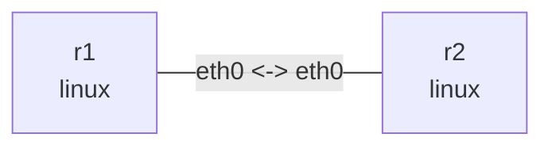

# WireGuard 双栈隧道

在此目录执行，依赖 `wireguard-tools`、`iproute2`、`tcpdump`、`iputils-ping` 和内核 WireGuard 支持。已有两节点 veth 承载 UDP underlay；setup.sh 在 namespace 内创建 wg0。无需 wg-quick、systemd 或容器。

## 拓扑与部署

```bash
nslab graph --format mermaid
```



```console
$ sudo nslab deploy
deployed topology: wireguard
$ sudo nslab inspect
status: deployed
...
```

## 生成密钥并配置

部署后运行脚本。每次生成新密钥，只在权限为 0700 的临时目录保存，成功或失败都会删除密钥文件。私钥保留在内核接口中直到接口销毁。脚本拒绝覆盖已有 wg0；再次实验先 redeploy。自定义部署名时设置 NSLAB_NAME；从虚拟环境运行时可通过 NSLAB_BIN 指定 nslab 的绝对路径。

```console
$ sudo bash ./setup.sh
WireGuard configured: r1 <-> r2 (IPv4 + IPv6)
$ sudo nslab exec --node r1 -- ip addr show dev wg0
... wg0 ... mtu 1420 ...
    inet 10.80.0.1/32 ...
    inet6 fd80::1/128 ...
$ sudo nslab exec --node r1 -- wg show wg0
interface: wg0
  public key: <public-key>
  private key: (hidden)
  listening port: 51820
peer: <peer-public-key>
  endpoint: 192.0.2.2:51820
  allowed ips: 10.80.0.2/32, fd80::2/128
```

## 握手和加密抓包

分别在 r1:eth0 与 r1:wg0 抓包，再从另一个终端 ping。eth0 是加密 UDP，wg0 可见明文 ICMP。刚配置时可能没有握手记录；发送流量才触发握手。wg show 不显示私钥，避免使用会输出密钥的 showconf/dump。

```console
$ sudo nslab exec --node r1 -- tcpdump -ni eth0 'udp port 51820'
... 192.0.2.1.51820 > 192.0.2.2.51820: UDP, length ...
$ sudo nslab exec --node r1 -- tcpdump -ni wg0 'icmp or icmp6'
... 10.80.0.1 > 10.80.0.2: ICMP echo request ...
$ sudo nslab exec --node r1 -- ping -c 3 -W 2 10.80.0.2
...
3 packets transmitted, 3 received, 0% packet loss
$ sudo nslab exec --node r1 -- ping -6 -c 3 -W 2 fd80::2
...
3 packets transmitted, 3 received, 0% packet loss
$ sudo nslab exec --node r1 -- wg show wg0 latest-handshakes
<peer-public-key> <nonzero-unix-timestamp>
$ sudo nslab exec --node r1 -- wg show wg0 transfer
<peer-public-key> <received-bytes> <sent-bytes>
```

## AllowedIPs 与路由

路由先选择 wg0，再由 AllowedIPs 按目的地址选择 peer；解密接收时还检查内层源地址是否属于该 peer 的 AllowedIPs。wg set 本身不添加 Linux 路由，本脚本显式添加 /32 和 /128 路由。下面暂时去掉 r1 peer 的正确 AllowedIPs：即使路由仍存在，ping 也会失败，然后恢复。

```bash
peer=$(sudo nslab exec --node r1 -- wg show wg0 peers)
```

```console
$ sudo nslab exec --node r1 -- wg set wg0 peer "$peer" allowed-ips 10.80.0.3/32
(no output)
$ sudo nslab exec --node r1 -- ip route get 10.80.0.2
10.80.0.2 dev wg0 src 10.80.0.1 ...
$ sudo nslab exec --node r1 -- ping -c 1 -W 2 10.80.0.2
... Required key not available ...
$ sudo nslab exec --node r1 -- wg set wg0 peer "$peer" allowed-ips 10.80.0.2/32,fd80::2/128
(no output)
$ sudo nslab exec --node r1 -- ping -c 2 -W 2 10.80.0.2
...
2 packets transmitted, 2 received, 0% packet loss
```

## MTU 与清理

wg0 MTU=1420，是对 1500 underlay 的保守设置；不同外层 IP 和路径 MTU 应重新计算。脚本直接创建的 wg0 不在 manifest 中，inspect 可能显示额外设备/路由；destroy 删除 namespace 后这些设备和内核密钥一起消失。停止抓包后再销毁，不安装任何持久配置。


```console
$ sudo nslab destroy
destroyed topology: wireguard
$ sudo nslab inspect
status: absent
...
```
