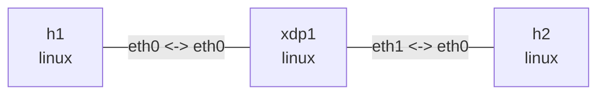

# XDP receive and transmit

## Goal

Connect two IPv4 subnets through `xdp1` and attach four eBPF sections to `xdp1:eth0`:

- `xdp/pass` counts frames and returns `XDP_PASS`.
- `xdp/drop` drops ICMP Echo Requests and passes other frames.
- `xdp/tx` converts Echo Requests into Replies and returns `XDP_TX`.
- `xdp/redirect` uses the Linux FIB to route packets to another interface with `XDP_REDIRECT`.

The commands use generic XDP (`xdpgeneric`) for consistent veth behavior. `XDP_TX` is an action
from an ingress XDP program, not a general-purpose egress hook.

## Dependencies

Install the compiler, libbpf headers, and observation tools on Ubuntu, then build the object:

```console
$ sudo apt-get install -y clang llvm libbpf-dev bpftool make
...

$ make
clang -I/usr/include/x86_64-linux-gnu -O2 -g -target bpf -Wall -Werror -c xdp_lab.c -o xdp_lab.o
```

## Graph

```bash
nslab graph --format mermaid
```



## Deploy

Run these commands from `examples/xdp`:

```console
$ sudo nslab deploy
deployed topology: xdp

$ sudo nslab inspect
status: deployed

NAME  KIND   STATUS    NAMESPACE
----  -----  --------  ---------------------
h1    linux  matching  nslab-xdp-h1-...
xdp1  linux  matching  nslab-xdp-xdp1-...
h2    linux  matching  nslab-xdp-h2-...
```

## XDP_PASS

`ip link set` has no output on success:

```console
$ sudo nslab exec --node xdp1 -- ip link set dev eth0 xdpgeneric object "$PWD/xdp_lab.o" section xdp/pass
(no output)

$ sudo nslab exec --node xdp1 -- ip -details link show dev eth0
... eth0 ... prog/xdp id <id> tag <tag> jited

$ sudo nslab exec --node h1 -- ping -c 2 10.40.1.254
PING 10.40.1.254 (10.40.1.254) 56(84) bytes of data.
64 bytes from 10.40.1.254: icmp_seq=1 ttl=64 time=<...> ms
64 bytes from 10.40.1.254: icmp_seq=2 ttl=64 time=<...> ms
2 packets transmitted, 2 received, 0% packet loss
```

Map keys are fixed: `0=RX`, `1=PASS`, `2=DROP`, `3=TX`, and `4=REDIRECT`.

```console
$ sudo bpftool -jp map dump name nslab_xdp_stats
[
  {"key": 0, "value": <rx>},
  {"key": 1, "value": <pass>},
  {"key": 2, "value": 0},
  {"key": 3, "value": 0},
  {"key": 4, "value": 0}
]
```

## XDP_DROP

Changing sections creates a new map, so counters start from zero:

```console
$ sudo nslab exec --node xdp1 -- ip link set dev eth0 xdpgeneric off
(no output)

$ sudo nslab exec --node xdp1 -- ip link set dev eth0 xdpgeneric object "$PWD/xdp_lab.o" section xdp/drop
(no output)

$ sudo nslab exec --node h1 -- ping -c 2 -W 1 10.40.1.254
PING 10.40.1.254 (10.40.1.254) 56(84) bytes of data.
2 packets transmitted, 0 received, 100% packet loss

$ sudo bpftool -jp map dump name nslab_xdp_stats
[
  {"key": 0, "value": <rx>},
  {"key": 1, "value": <arp-and-other>},
  {"key": 2, "value": 2},
  {"key": 3, "value": 0},
  {"key": 4, "value": 0}
]
```

The nonzero ping status is expected. ARP and frames other than ICMP Echo Requests still take
the `XDP_PASS` path.

## XDP_TX

Attach the tx section and record the kernel ICMP counters in `h2`:

```console
$ sudo nslab exec --node xdp1 -- ip link set dev eth0 xdpgeneric off
(no output)

$ sudo nslab exec --node xdp1 -- ip link set dev eth0 xdpgeneric object "$PWD/xdp_lab.o" section xdp/tx
(no output)

$ sudo nslab exec --node xdp1 -- nstat -az IcmpInEchos IcmpOutEchoReps
#kernel
IcmpInEchos                  <before>
IcmpOutEchoReps              <before>

$ sudo nslab exec --node h1 -- ping -c 2 10.40.1.254
PING 10.40.1.254 (10.40.1.254) 56(84) bytes of data.
64 bytes from 10.40.1.254: icmp_seq=1 ttl=64 time=<...> ms
64 bytes from 10.40.1.254: icmp_seq=2 ttl=64 time=<...> ms
2 packets transmitted, 2 received, 0% packet loss

$ sudo nslab exec --node xdp1 -- nstat -az IcmpInEchos IcmpOutEchoReps
#kernel
IcmpInEchos                  <same-as-before>
IcmpOutEchoReps              <same-as-before>

$ sudo bpftool -jp map dump name nslab_xdp_stats
[
  {"key": 0, "value": <rx>},
  {"key": 1, "value": <arp-and-other>},
  {"key": 2, "value": 0},
  {"key": 3, "value": 2},
  {"key": 4, "value": 0}
]
```

Ping succeeds while both kernel ICMP counters remain unchanged. The Echo Request did not enter
the IPv4/ICMP stack in `xdp1`; the XDP program constructed and transmitted the Reply directly.

## XDP_REDIRECT

Detach the tx section and access `h2` from `xdp1` once so the FIB helper can resolve the neighbor
on `eth1`:

```console
$ sudo nslab exec --node xdp1 -- ip link set dev eth0 xdpgeneric off
(no output)

$ sudo nslab exec --node xdp1 -- ping -c 1 10.40.2.2
PING 10.40.2.2 (10.40.2.2) 56(84) bytes of data.
64 bytes from 10.40.2.2: icmp_seq=1 ttl=64 time=<...> ms
1 packets transmitted, 1 received, 0% packet loss

$ sudo nslab exec --node xdp1 -- ip neigh show dev eth1
10.40.2.2 lladdr <mac> REACHABLE
```

Attach the redirect section only to `xdp1:eth0`. XDP routes each Echo Request across interfaces;
the Echo Reply enters `eth1` and follows normal Linux IPv4 forwarding:

```console
$ sudo nslab exec --node xdp1 -- ip link set dev eth0 xdpgeneric object "$PWD/xdp_lab.o" section xdp/redirect
(no output)

$ sudo nslab exec --node h1 -- ping -c 2 10.40.2.2
PING 10.40.2.2 (10.40.2.2) 56(84) bytes of data.
64 bytes from 10.40.2.2: icmp_seq=1 ttl=63 time=<...> ms
64 bytes from 10.40.2.2: icmp_seq=2 ttl=63 time=<...> ms
2 packets transmitted, 2 received, 0% packet loss

$ sudo bpftool -jp map dump name nslab_xdp_stats
[
  {"key": 0, "value": <rx>},
  {"key": 1, "value": <arp-and-other>},
  {"key": 2, "value": 0},
  {"key": 3, "value": 0},
  {"key": 4, "value": 2}
]
```

An increasing key `4` proves the request took `bpf_redirect()`. The program uses
`bpf_fib_lookup()` for the egress ifindex and next-hop link-layer addresses, then decrements the
IPv4 TTL and updates its checksum before redirecting the frame.

## Clean up

Deleting the namespaces detaches the XDP program and releases its unpinned map:

```console
$ sudo nslab destroy
destroyed topology: xdp

$ make clean
rm -f xdp_lab.o
```

[View nslab.yaml](https://github.com/calcky/nslab/blob/main/examples/xdp/nslab.yaml) ·
[View eBPF source](https://github.com/calcky/nslab/blob/main/examples/xdp/xdp_lab.c) ·
[View example README](https://github.com/calcky/nslab/blob/main/examples/xdp/README.md)
