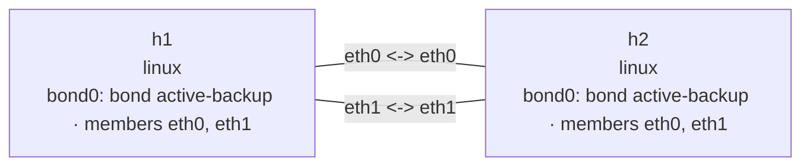

# Bond active-backup 实验

这个实验在两个 Linux network namespace 之间建立两条链路，并在两端分别创建
`bond0`。`eth0` 是首选活动成员，`eth1` 是备用成员；关闭主链路后，两端会通过
MII carrier 检测切换到 `eth1`，恢复后再选择 `eth0`。

## 拓扑图

```bash
nslab graph --format mermaid
```



以下为典型输出；接口索引、MAC 地址和 ICMP 时延会随运行变化。

## 部署

```console
$ sudo nslab deploy
deployed topology: bond-active-backup

$ sudo nslab inspect
status: deployed

NAME  KIND   STATUS    NAMESPACE
----  -----  --------  ----------------------------------
h1    linux  matching  nslab-bond-active-backup-h1-...
h2    linux  matching  nslab-bond-active-backup-h2-...
```

## 查看初始主备状态

```console
$ sudo nslab exec --node h1 -- /usr/bin/grep -E 'Bonding Mode|Primary Slave|Currently Active Slave|Slave Interface|MII Status' /proc/net/bonding/bond0
Bonding Mode: fault-tolerance (active-backup)
Primary Slave: eth0 (primary_reselect always)
Currently Active Slave: eth0
MII Status: up
Slave Interface: eth0
MII Status: up
Slave Interface: eth1
MII Status: up

$ sudo nslab exec --node h1 -- /usr/bin/ping -c 2 10.60.0.2
PING 10.60.0.2 (10.60.0.2) 56(84) bytes of data.
64 bytes from 10.60.0.2: icmp_seq=1 ttl=64 time=<time> ms
64 bytes from 10.60.0.2: icmp_seq=2 ttl=64 time=<time> ms
2 packets transmitted, 2 received, 0% packet loss
```

地址只配置在 `bond0` 上，两个成员接口不持有三层地址。正常情况下只有 `eth0`
发送流量，但两个成员都保持链路状态检测。

## 模拟主链路故障

```console
$ sudo nslab exec --node h1 -- /bin/sh -c 'ip link set eth0 down; sleep 1; grep "Currently Active Slave" /proc/net/bonding/bond0'
Currently Active Slave: eth1

$ sudo nslab exec --node h2 -- /usr/bin/grep 'Currently Active Slave' /proc/net/bonding/bond0
Currently Active Slave: eth1

$ sudo nslab exec --node h1 -- /usr/bin/ping -c 2 10.60.0.2
PING 10.60.0.2 (10.60.0.2) 56(84) bytes of data.
64 bytes from 10.60.0.2: icmp_seq=1 ttl=64 time=<time> ms
64 bytes from 10.60.0.2: icmp_seq=2 ttl=64 time=<time> ms
2 packets transmitted, 2 received, 0% packet loss
```

veth 两端共享 carrier；`h1:eth0` 关闭后，`h2:eth0` 也失去 carrier，所以两端都切换
到第二条链路。

## 恢复首选链路

```console
$ sudo nslab exec --node h1 -- /bin/sh -c 'ip link set eth0 up; sleep 1; grep "Currently Active Slave" /proc/net/bonding/bond0'
Currently Active Slave: eth0

$ sudo nslab exec --node h2 -- /usr/bin/grep 'Currently Active Slave' /proc/net/bonding/bond0
Currently Active Slave: eth0
```

`primary: eth0` 使用内核默认的 `primary_reselect=always`，因此首选成员恢复后会重新成为
活动成员。

## 清理

```console
$ sudo nslab destroy
destroyed topology: bond-active-backup
```
