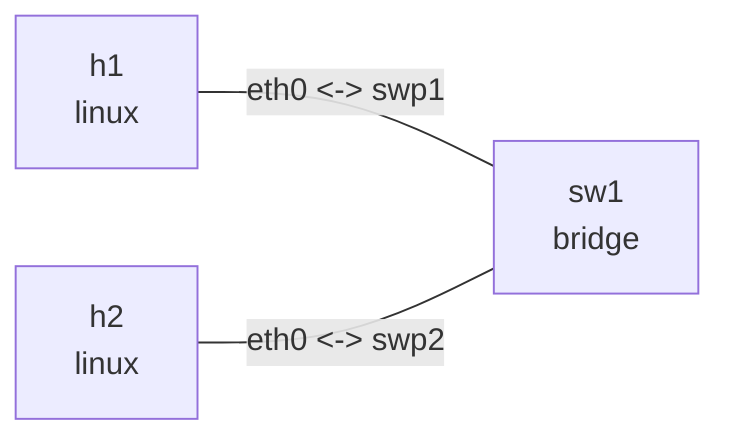

# Linux bridge FDB 实验

这个实验用于观察 Linux bridge 的二层转发和 FDB（Forwarding Database）学习过程。
`h1` 和 `h2` 位于同一 IPv4 子网，中间由 `sw1` 的 `br0` 转发。

## 拓扑图

```bash
nslab graph --format mermaid
```



以下输出省略了会随运行变化的接口索引、MAC 地址和计数器。

## 运行

从当前目录执行。`graph` 不需要 root，其余命令需要 root：

```console
$ sudo nslab deploy
deployed topology: bridge-fdb

$ sudo nslab inspect
status: deployed

NAME  KIND    STATUS    NAMESPACE
----  ------  --------  ----------------------------
h1    linux   matching  nslab-bridge-fdb-h1-...
sw1   bridge  matching  nslab-bridge-fdb-sw1-...
h2    linux   matching  nslab-bridge-fdb-h2-...
```

第二次 `deploy` 不会重复创建资源：

```console
$ sudo nslab deploy
topology already deployed: bridge-fdb
```

## 观察 FDB 学习

初始 FDB 主要包含本地和永久表项：

```console
$ sudo nslab exec --node sw1 -- bridge fdb show br br0
... dev swp1 self permanent
... dev swp2 self permanent
```

从 `h1` 向 `h2` 发包：

```console
$ sudo nslab exec --node h1 -- ping -c 3 10.10.0.2
PING 10.10.0.2 (10.10.0.2) 56(84) bytes of data.
64 bytes from 10.10.0.2: icmp_seq=1 ttl=64 time=<time> ms
64 bytes from 10.10.0.2: icmp_seq=2 ttl=64 time=<time> ms
64 bytes from 10.10.0.2: icmp_seq=3 ttl=64 time=<time> ms

--- 10.10.0.2 ping statistics ---
3 packets transmitted, 3 received, 0% packet loss
```

bridge 随后会把源 MAC 与入端口关联，端口计数器也会增加：

```console
$ sudo nslab exec --node sw1 -- bridge fdb show br br0
<h1-mac> dev swp1 master br0
<h2-mac> dev swp2 master br0
...

$ sudo nslab exec --node sw1 -- ip -s link show swp1
... swp1 ... state UP ...
    RX:  bytes  packets  errors  dropped  missed  mcast
         ...    ...      0       0        0       ...
    TX:  bytes  packets  errors  dropped  carrier  collsns
         ...    ...      0       0        0        0

$ sudo nslab exec --node sw1 -- ip -s link show swp2
... swp2 ... state UP ...
    RX:  bytes  packets  errors  dropped  missed  mcast
         ...    ...      0       0        0       ...
    TX:  bytes  packets  errors  dropped  carrier  collsns
         ...    ...      0       0        0        0
```

## 清理

```console
$ sudo nslab destroy
destroyed topology: bridge-fdb

$ sudo nslab destroy
topology already absent: bridge-fdb
```

重复 `destroy` 也是成功操作，便于反复执行实验。
