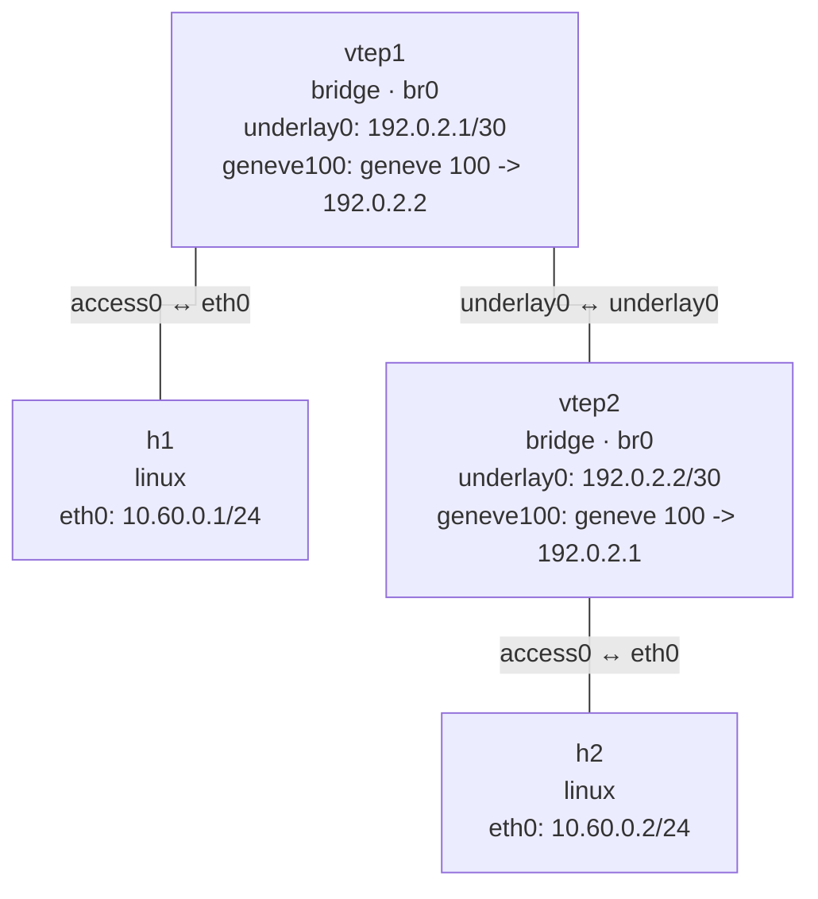

# Geneve

This lab builds a two-node Layer 2 Geneve overlay. `vtep1` and `vtep2` use a direct underlay
link for the outer UDP traffic, while `geneve100` is attached to each local bridge.

## Topology

```bash
nslab graph --format mermaid
```



## Run

```console
$ sudo nslab deploy
deployed topology: geneve

$ sudo nslab inspect
status: deployed

NAME   KIND    STATUS    NAMESPACE
-----  ------  --------  ----------------------
h1     linux   matching  nslab-geneve-h1-...
vtep1  bridge  matching  nslab-geneve-vtep1-...
vtep2  bridge  matching  nslab-geneve-vtep2-...
h2     linux   matching  nslab-geneve-h2-...

$ sudo nslab exec --node h1 -- /usr/bin/ping -c 1 10.60.0.2
PING 10.60.0.2 (10.60.0.2) 56(84) bytes of data.
64 bytes from 10.60.0.2: icmp_seq=1 ttl=64 time=<time> ms

--- 10.60.0.2 ping statistics ---
1 packets transmitted, 1 received, 0% packet loss

$ sudo nslab destroy
destroyed topology: geneve
```

With a 1500-byte underlay, nslab derives a 1450-byte Geneve MTU for IPv4. The Geneve source
address is selected by the underlay route; only the unicast `remote` endpoint is declared.

[View nslab.yaml](https://github.com/calcky/nslab/blob/main/examples/geneve/nslab.yaml)
