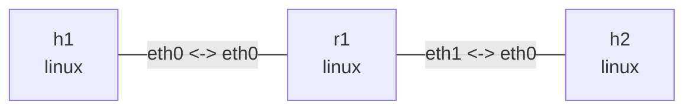

# Linux IPv6 转发实验

这个实验用于观察 Linux 的 IPv6 路由与转发路径。`r1` 连接两个 `/64` 子网，并通过
`net.ipv6.conf.all.forwarding=1` 开启 IPv6 转发。两台主机使用显式默认路由。

## 拓扑图

```bash
nslab graph --format mermaid
```



以下为典型输出；link-local 地址、接口索引、计数器和 ICMP 时延会随运行变化。

## 运行

```console
$ sudo nslab deploy
deployed topology: ipv6-forward
```

等待内核完成 IPv6 duplicate address detection（DAD），再检查状态：

```bash
sleep 2
```

```console
$ sudo nslab inspect
status: deployed

NAME  KIND   STATUS    NAMESPACE
----  -----  --------  -------------------------------
h1    linux  matching  nslab-ipv6-forward-h1-...
r1    linux  matching  nslab-ipv6-forward-r1-...
h2    linux  matching  nslab-ipv6-forward-h2-...
```

## 观察 IPv6 配置

```console
$ sudo nslab exec --node r1 -- cat /proc/sys/net/ipv6/conf/all/forwarding
1

$ sudo nslab exec --node r1 -- ip -6 address show
... eth0 ...
    inet6 2001:db8:1::1/64 scope global
    inet6 fe80::.../64 scope link
... eth1 ...
    inet6 2001:db8:2::1/64 scope global
    inet6 fe80::.../64 scope link
```

主机路由和下一跳如下：

```console
$ sudo nslab exec --node h1 -- ip -6 route show
2001:db8:1::/64 dev eth0 proto kernel metric 256 pref medium
default via 2001:db8:1::1 dev eth0 metric 1024 pref medium

$ sudo nslab exec --node h1 -- ip -6 route get 2001:db8:2::2
2001:db8:2::2 via 2001:db8:1::1 dev eth0 src 2001:db8:1::2 metric 1024 pref medium

$ sudo nslab exec --node h2 -- ip -6 route show
2001:db8:2::/64 dev eth0 proto kernel metric 256 pref medium
default via 2001:db8:2::1 dev eth0 metric 1024 pref medium
```

## 验证双向转发

```console
$ sudo nslab exec --node h1 -- ping -6 -c 3 2001:db8:2::2
64 bytes from 2001:db8:2::2: icmp_seq=1 ttl=63 time=<time> ms
...
3 packets transmitted, 3 received, 0% packet loss

$ sudo nslab exec --node h2 -- ping -6 -c 3 2001:db8:1::2
64 bytes from 2001:db8:1::2: icmp_seq=1 ttl=63 time=<time> ms
...
3 packets transmitted, 3 received, 0% packet loss

$ sudo nslab exec --node r1 -- ip -s link show eth0
... eth0 ... state UP ...
    RX: ... packets ...
    TX: ... packets ...

$ sudo nslab exec --node r1 -- ip -s link show eth1
... eth1 ... state UP ...
    RX: ... packets ...
    TX: ... packets ...
```

## 清理

```console
$ sudo nslab destroy
destroyed topology: ipv6-forward
```

修改 `nslab.yaml` 后可以用 `sudo nslab redeploy` 重新创建整个实验。
