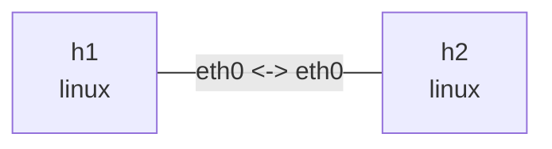

# Linux netem 实验

这个实验在 `h1` 与 `h2` 的 veth 两端都安装 netem egress qdisc，用于观察速率、延迟、
抖动和随机丢包。echo request 和 reply 各经历一次 egress delay，所以 RTT 中心值约为
`200ms`。

## 拓扑图

```bash
nslab graph --format mermaid
```



该链路双向配置 `10mbit` rate、`100ms` delay、`10ms` jitter 和 `5%` loss。以下统计输出
会随随机丢包和流量变化。

## 运行

```console
$ sudo nslab deploy
deployed topology: netem

$ sudo nslab inspect
status: deployed

NAME  KIND   STATUS    NAMESPACE
----  -----  --------  ------------------------
h1    linux  matching  nslab-netem-h1-...
h2    linux  matching  nslab-netem-h2-...
```

## 查看 qdisc

两端都应显示相同的 netem 参数：

```console
$ sudo nslab exec --node h1 -- tc -s qdisc show dev eth0
qdisc netem ... root ... limit 1000 delay 100ms 10ms loss 5% rate 10Mbit
 Sent ... bytes ... pkt (dropped ..., overlimits ... requeues 0)

$ sudo nslab exec --node h2 -- tc -s qdisc show dev eth0
qdisc netem ... root ... limit 1000 delay 100ms 10ms loss 5% rate 10Mbit
 Sent ... bytes ... pkt (dropped ..., overlimits ... requeues 0)
```

## 产生流量

```console
$ sudo nslab exec --node h1 -- ping -c 20 -i 0.2 10.30.0.2
PING 10.30.0.2 (10.30.0.2) 56(84) bytes of data.
64 bytes from 10.30.0.2: icmp_seq=1 ttl=64 time=<about-200> ms
...
20 packets transmitted, <received> received, <loss>% packet loss

$ sudo nslab exec --node h2 -- ping -c 20 -i 0.2 10.30.0.1
PING 10.30.0.1 (10.30.0.1) 56(84) bytes of data.
64 bytes from 10.30.0.1: icmp_seq=1 ttl=64 time=<about-200> ms
...
20 packets transmitted, <received> received, <loss>% packet loss
```

少量样本可能恰好没有丢包；增加样本后，统计丢包率会逐渐接近配置值。

## 修改参数

编辑 `nslab.yaml` 中的 `rate`、`delay_ms`、`jitter_ms` 或 `loss_percent`，然后重建拓扑：

```console
$ sudo nslab redeploy
redeployed topology: netem

$ sudo nslab inspect
status: deployed
...

$ sudo nslab exec --node h1 -- ping -c 20 10.30.0.2
64 bytes from 10.30.0.2: icmp_seq=1 ttl=64 time=<new-delay> ms
...
20 packets transmitted, <received> received, <loss>% packet loss
```

## 其他根 qdisc

`netem` 与 `qdisc` 互斥；如果只想做令牌桶整形或 fq_codel，把链路上的 `netem` 替换为
下面其中一种配置：

```yaml
qdisc:
  kind: tbf
  rate: 10mbit
  burst: 32kb
  latency_ms: 400
```

```yaml
qdisc:
  kind: fq_codel
  target_ms: 5
  interval_ms: 100
  limit: 10240
  ecn: true
```

改完后运行 `sudo nslab redeploy`，再用 `sudo nslab exec --node h1 -- tc -s qdisc show dev
eth0` 查看参数。四种配置的完整并行实验见 [qdisc 示例](../qdisc/)；CAKE 需要可选的
`sch_cake` 内核模块，详见 [CAKE 示例](../cake/)。

## 清理

```console
$ sudo nslab destroy
destroyed topology: netem
```
