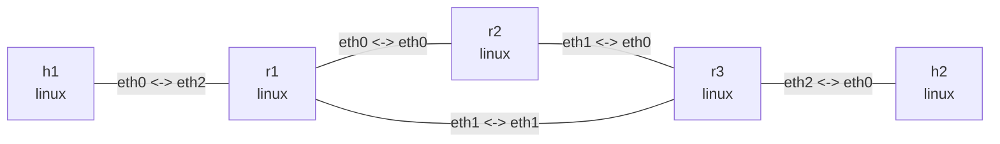

# OSPFv2 动态路由实验

这个实验使用 FRRouting 的 `ospfd` 在三台 Linux 路由器之间建立 OSPFv2 三角形。
主机只保留到远端 LAN 的静态路由，路由器之间的远端网段由 OSPF 学习。

安装 daemon（Ubuntu）：

```bash
sudo apt update
sudo apt install -y frr frr-pythontools
```

## 拓扑图

```bash
nslab graph --format mermaid
```



以下为典型输出；FRR timer、消息计数、接口索引和 ICMP 时延会随运行变化。

## 运行

```console
$ sudo nslab deploy
deployed topology: ospf

$ sudo nslab inspect
status: deployed

NAME  KIND   STATUS    NAMESPACE
----  -----  --------  ----------------------
h1    linux  matching  nslab-ospf-h1-...
r1    linux  matching  nslab-ospf-r1-...
r2    linux  matching  nslab-ospf-r2-...
r3    linux  matching  nslab-ospf-r3-...
h2    linux  matching  nslab-ospf-h2-...
```

`deploy` 等待 daemon 启动，但不等待 OSPF 邻居收敛。

## 查看邻居和路由

邻居进入 `Full` 后，`r1` 能看到 `r2` 和 `r3`：

```console
$ sudo nslab exec --node r1 -- vtysh -N nslab-ospf-r1 -c "show ip ospf neighbor"
Neighbor ID  Pri  State         Dead Time  Address    Interface
2.2.2.2        1  Full/DROther  <time>     10.0.12.2  eth0:10.0.12.1
3.3.3.3        1  Full/DROther  <time>     10.0.13.2  eth1:10.0.13.1
```

远端 LAN 由 OSPF 安装到 FRR RIB 和内核 FIB：

```console
$ sudo nslab exec --node r1 -- vtysh -N nslab-ospf-r1 -c "show ip route ospf"
...
O>* 192.0.3.0/24 [110/20] via 10.0.13.2, eth1, weight 1, <time>

$ sudo nslab exec --node r1 -- ip -4 route
10.0.12.0/30 dev eth0 proto kernel scope link src 10.0.12.1
10.0.13.0/30 dev eth1 proto kernel scope link src 10.0.13.1
192.0.1.0/24 dev eth2 proto kernel scope link src 192.0.1.1
192.0.3.0/24 via 10.0.13.2 dev eth1 proto ospf metric 20

$ sudo nslab exec --node h1 -- ping -c 3 192.0.3.2
64 bytes from 192.0.3.2: icmp_seq=1 ttl=62 time=<time> ms
...
3 packets transmitted, 3 received, 0% packet loss
```

## 观察故障收敛

关闭 `r1` 到 `r3` 的直连主路径，等待路由改走 `r2`。端口状态修改成功时没有输出：

```bash
sudo nslab exec --node r1 -- ip link set eth1 down
sleep 10
```

```console
$ sudo nslab exec --node r1 -- vtysh -N nslab-ospf-r1 -c "show ip ospf neighbor"
Neighbor ID  Pri  State         Dead Time  Address    Interface
2.2.2.2        1  Full/DROther  <time>     10.0.12.2  eth0:10.0.12.1

$ sudo nslab exec --node r1 -- ip -4 route get 192.0.3.2
192.0.3.2 via 10.0.12.2 dev eth0 src 10.0.12.1
    cache

$ sudo nslab exec --node h1 -- ping -c 3 192.0.3.2
64 bytes from 192.0.3.2: icmp_seq=1 ttl=61 time=<time> ms
...
3 packets transmitted, 3 received, 0% packet loss
```

恢复直连链路成功时没有输出：

```bash
sudo nslab exec --node r1 -- ip link set eth1 up
```

## 清理

```console
$ sudo nslab destroy
destroyed topology: ospf
```
