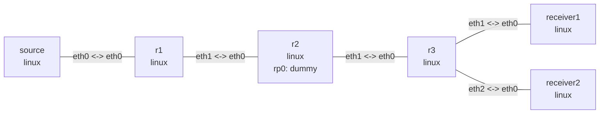

# IPv4 PIM-SM 与 IGMP 组播实验

这个实验由 OSPF 提供单播 RPF 路由，三台路由器运行 FRRouting `pimd`，并使用
`10.255.0.2` 作为静态 RP。两个接收端分别通过 IGMP 加入 `239.1.1.1`，观察 r3 将
来自 source 的一份 UDP 流复制到两个下游接口。

安装依赖（Ubuntu）：

```bash
sudo apt install -y frr frr-pythontools
```

## 拓扑图

```bash
nslab graph --format mermaid
```



下面是典型输出；邻居 uptime、timer 和 UDP 源端口会随运行变化。

## 部署

```console
$ sudo nslab deploy
deployed topology: pim

$ sudo nslab inspect
status: deployed

NAME       KIND   STATUS    NAMESPACE
---------  -----  --------  ---------------------
source     linux  matching  nslab-pim-source-...
r1         linux  matching  nslab-pim-r1-...
r2         linux  matching  nslab-pim-r2-...
r3         linux  matching  nslab-pim-r3-...
receiver1  linux  matching  nslab-pim-receiver1-...
receiver2  linux  matching  nslab-pim-receiver2-...
```

`deploy` 等待 FRR daemon 启动，但 OSPF 和 PIM 邻居仍可能需要数秒收敛。

## 查看 PIM 邻居与 RP

```console
$ sudo nslab exec -N r2 -- vtysh -N nslab-pim-r2 -c "show ip pim neighbor"
Interface  Neighbor   Uptime    Holdtime  DR Pri
eth0       10.0.12.1  <time>    <time>    1
eth1       10.0.23.2  <time>    <time>    1

$ sudo nslab exec -N r2 -- vtysh -N nslab-pim-r2 -c "show ip pim rp-info"
RP address  group/prefix-list  OIF  I am RP  Source  Group-Type
10.255.0.2  224.0.0.0/4        rp0  yes      Static  ASM
```

`rp0` 是 r2 上承载 RP `/32` 的 dummy 接口，OSPF 将它发布给 r1 和 r3，用于 PIM
的 RPF 查找。

## 加入组播并发送 UDP

在两个独立终端中启动接收端；命令会保持运行，直到收到 3 个包：

```console
$ sudo nslab exec -N receiver1 -- python3 multicast_receive.py 192.0.31.2
joined 239.1.1.1:5000 on 192.0.31.2
pim-2 from 192.0.1.2:<port>
pim-3 from 192.0.1.2:<port>
pim-4 from 192.0.1.2:<port>
```

```console
$ sudo nslab exec -N receiver2 -- python3 multicast_receive.py 192.0.32.2
joined 239.1.1.1:5000 on 192.0.32.2
pim-2 from 192.0.1.2:<port>
pim-3 from 192.0.1.2:<port>
pim-4 from 192.0.1.2:<port>
```

在接收命令仍运行时，r3 能看到两个 IGMP membership：

```console
$ sudo nslab exec -N r3 -- vtysh -N nslab-pim-r3 -c "show ip igmp groups"
Total IGMP groups: 2
Interface  Group      Mode  Timer   Srcs  V  Uptime
eth1       239.1.1.1  EXCL  <time>  1     3  <time>
eth2       239.1.1.1  EXCL  <time>  1     3  <time>
```

在第三个终端发送 10 个包。默认等待 5 秒，让 `(*,G)` join 到达 RP；首包也可能用于
建立 `(S,G)` 状态，因此接收端不要求收到序号 1。

```console
$ sudo nslab exec -N source -- python3 multicast_send.py 192.0.1.2
sent 10 packets to 239.1.1.1:5000
```

r3 的 multicast routing table 显示同一 `(S,G)` 从 `eth0` 进入并复制到 `eth1`、
`eth2`：

```console
$ sudo nslab exec -N r3 -- vtysh -N nslab-pim-r3 -c "show ip mroute"
IP Multicast Routing Table
Source     Group      Flags  Proto  Input  Output  TTL  Uptime
*          239.1.1.1  SC     IGMP   eth0   pimreg  1    <time>
                              IGMP          eth1    1
                              IGMP          eth2    1
192.0.1.2  239.1.1.1  ST     STAR   eth0   eth1    1    <time>
                              STAR          eth2    1
```

## 清理

```console
$ sudo nslab destroy
destroyed topology: pim
```
