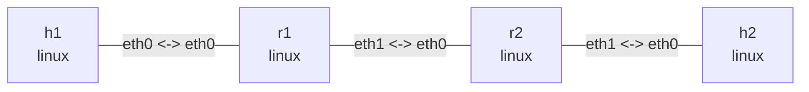

# MTU、PMTU 与 IP 分片实验

这个双栈实验在 `h1` 与 `h2` 之间放置两台 Linux 路由器。外侧链路 MTU 为 1500，
`r1:eth1` 与 `r2:eth0` 之间的瓶颈链路 MTU 为 IPv6 允许的最小值 1280。实验对比：

- IPv4 清除 DF 时，路由器如何分片、接收端如何重组；
- IPv4 设置 DF 时，ICMP Fragmentation Needed 如何更新源主机的 PMTU；
- IPv6 路由器为何不分片，而是返回 ICMPv6 Packet Too Big。

观察命令还需要 `tcpdump` 和 `tracepath`：

```bash
sudo apt install -y tcpdump iputils-tracepath
```

## 拓扑图

```bash
nslab graph --format mermaid
```



中间的 `r1:eth1 <-> r2:eth0` 为 MTU 1280；另外两条链路为 MTU 1500。以下输出中的
接口索引、MAC、计数器、PMTU 有效期和时延会随运行变化。

## 部署并确认链路

```console
$ sudo nslab deploy
deployed topology: pmtu

$ sudo nslab inspect
status: deployed

NAME  KIND   STATUS    NAMESPACE
----  -----  --------  -----------------------
h1    linux  matching  nslab-pmtu-h1-...
h2    linux  matching  nslab-pmtu-h2-...
r1    linux  matching  nslab-pmtu-r1-...
r2    linux  matching  nslab-pmtu-r2-...

$ sudo nslab exec --node r1 -- ip -o link show dev eth1
<index>: eth1@...: <BROADCAST,MULTICAST,UP,LOWER_UP> mtu 1280 ...
```

小包可以通过两台路由器；回复的 TTL/Hop Limit 从 64 降为 62：

```console
$ sudo nslab exec --node h1 -- ping -4 -c 1 -W 2 198.51.100.2
64 bytes from 198.51.100.2: icmp_seq=1 ttl=62 time=<time> ms
1 packets transmitted, 1 received, 0% packet loss

$ sudo nslab exec --node h1 -- ping -6 -c 1 -W 2 2001:db8:3::2
64 bytes from 2001:db8:3::2: icmp_seq=1 ttl=62 time=<time> ms
1 packets transmitted, 1 received, 0% packet loss
```

## IPv4 路由器分片

在终端一抓取离开 `r1` 瓶颈接口的两个 IPv4 fragment：

```console
$ sudo nslab exec --node r1 -- tcpdump -nn -v -i eth1 -c 2 'ip[6:2] & 0x3fff != 0'
tcpdump: listening on eth1, link-type EN10MB (Ethernet), snapshot length 262144 bytes
IP (... id <id>, offset 0, flags [+], proto ICMP (1), length 1276)
    192.0.2.2 > 198.51.100.2: ICMP echo request, ... length 1256
IP (... id <id>, offset 1256, flags [none], proto ICMP (1), length 172)
    192.0.2.2 > 198.51.100.2: ip-proto-1
2 packets captured
```

在终端二发送一个 1400 字节 ICMP payload，并用 `-M dont` 清除 DF：

```console
$ sudo nslab exec --node h1 -- ping -4 -c 1 -W 2 -M dont -s 1400 198.51.100.2
PING 198.51.100.2 (198.51.100.2) 1400(1428) bytes of data.
1408 bytes from 198.51.100.2: icmp_seq=1 ttl=62 time=<time> ms
1 packets transmitted, 1 received, 0% packet loss
```

IPv4 总长度是 `1400 + 8 + 20 = 1428`，超过 1280。`r1` 把请求拆成两片；除最后一片
外，fragment payload 必须按 8 字节对齐，所以第一片总长是 1276。计数器分别证明
路由器执行了分片、终点执行了重组：

```console
$ sudo nslab exec --node r1 -- nstat -az IpFragOKs IpFragCreates
#kernel
IpFragOKs                       1                  0.0
IpFragCreates                   2                  0.0

$ sudo nslab exec --node h2 -- nstat -az IpReasmReqds IpReasmOKs
#kernel
IpReasmReqds                    2                  0.0
IpReasmOKs                      1                  0.0
```

## IPv4 DF 与 PMTU

重建拓扑会清除刚才的计数器和 route exception。终端一在 `r1` 面向源主机的接口抓取
ICMP Type 3 / Code 4：

```console
$ sudo nslab redeploy
redeployed topology: pmtu

$ sudo nslab exec --node r1 -- tcpdump -nn -l -i eth0 -c 1 'icmp[0] == 3 and icmp[1] == 4'
tcpdump: listening on eth0, link-type EN10MB (Ethernet), snapshot length 262144 bytes
IP 192.0.2.1 > 192.0.2.2: ICMP 198.51.100.2 unreachable - need to frag (mtu 1280), length 556
1 packet captured
```

终端二发送相同大小的数据，但用 `-M do` 设置 DF。这个失败是预期结果：

```console
$ sudo nslab exec --node h1 -- ping -4 -c 1 -W 2 -M do -s 1400 198.51.100.2 || true
PING 198.51.100.2 (198.51.100.2) 1400(1428) bytes of data.
From 192.0.2.1 icmp_seq=1 Frag needed and DF set (mtu = 1280)
1 packets transmitted, 0 received, +1 errors, 100% packet loss

$ sudo nslab exec --node h1 -- ip -4 route get 198.51.100.2
198.51.100.2 via 192.0.2.1 dev eth0 src 192.0.2.2
    cache expires <seconds> mtu 1280
```

`h1` 收到 ICMP 后没有修改接口 MTU，而是给这个目的路径保存一条带有效期的 PMTU
exception。后续使用 DF 的本地发送会按 1280 约束报文大小。

## IPv6 Packet Too Big

IPv6 路由器不会为转发报文分片。1400 字节 payload 加 40 字节 IPv6 头和 8 字节
ICMPv6 头后总长为 1448，`r1` 因而返回 Packet Too Big：

```console
$ sudo nslab exec --node h1 -- ping -6 -c 1 -W 2 -s 1400 2001:db8:3::2 || true
PING 2001:db8:3::2 (2001:db8:3::2) 1400 data bytes
From 2001:db8:1::1 icmp_seq=1 Packet too big: mtu=1280
1 packets transmitted, 0 received, +1 errors, 100% packet loss

$ sudo nslab exec --node h1 -- ip -6 route get 2001:db8:3::2
2001:db8:3::2 from :: via 2001:db8:1::1 dev eth0 src 2001:db8:1::2 ...
    expires <seconds> mtu 1280 pref medium

$ sudo nslab exec --node h1 -- ping -6 -c 1 -W 2 -s 1232 2001:db8:3::2
PING 2001:db8:3::2 (2001:db8:3::2) 1232 data bytes
1240 bytes from 2001:db8:3::2: icmp_seq=1 ttl=62 time=<time> ms
1 packets transmitted, 1 received, 0% packet loss
```

`1280 - 40 - 8 = 1232`，因此最后一个 ICMPv6 Echo Request 正好符合已学习的 PMTU。

`tracepath` 也可以主动发现两种地址族的路径 MTU：

```console
$ sudo nslab exec --node h1 -- tracepath -n -m 5 198.51.100.2
...
Resume: pmtu 1280 hops 3 back 3

$ sudo nslab exec --node h1 -- tracepath -6 -n -m 5 2001:db8:3::2
...
Resume: pmtu 1280 hops 3 back 3
```

## 清理

```console
$ sudo nslab destroy
destroyed topology: pmtu
```
