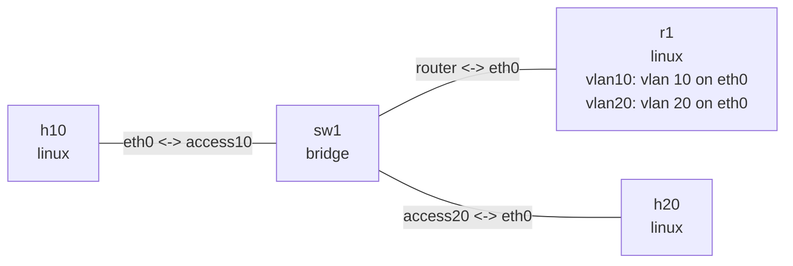

# Router-on-a-stick 实验

这个实验让 `r1` 通过一条 trunk 同时连接 VLAN 10 和 VLAN 20。`vlan10`、`vlan20`
是 `eth0` 上的三层子接口；`sw1` 将主机端口配置为 untagged access，将路由器端口
配置为 tagged trunk。Linux IPv4 转发负责两个 VLAN 之间的通信。

## 拓扑图

```console
$ nslab graph --format mermaid
flowchart LR
    n0["h10\nlinux"]
    n1["sw1\nbridge"]
    n2["r1\nlinux\nvlan10: vlan 10 on eth0\nvlan20: vlan 20 on eth0"]
    n3["h20\nlinux"]
    n0 -- "eth0 <-> access10" --- n1
    n1 -- "router <-> eth0" --- n2
    n1 -- "access20 <-> eth0" --- n3
```



以下为典型输出；接口索引、MAC 地址和 ICMP 时延会随运行变化。

## 部署

```console
$ sudo nslab deploy
deployed topology: router-on-a-stick

$ sudo nslab inspect
status: deployed

NAME  KIND    STATUS    NAMESPACE
----  ------  --------  -----------------------------------
h10   linux   matching  nslab-router-on-a-stick-h10-...
sw1   bridge  matching  nslab-router-on-a-stick-sw1-...
r1    linux   matching  nslab-router-on-a-stick-r1-...
h20   linux   matching  nslab-router-on-a-stick-h20-...
```

## 查看二层和三层配置

```console
$ sudo nslab exec --node sw1 -- bridge vlan show
port      vlan-id
access10  10 PVID Egress Untagged
router    10
          20
access20  20 PVID Egress Untagged

$ sudo nslab exec --node r1 -- ip -d link show type vlan
<index>: vlan10@eth0: <BROADCAST,MULTICAST,UP,LOWER_UP> ...
    vlan protocol 802.1Q id 10 <REORDER_HDR>
<index>: vlan20@eth0: <BROADCAST,MULTICAST,UP,LOWER_UP> ...
    vlan protocol 802.1Q id 20 <REORDER_HDR>

$ sudo nslab exec --node r1 -- ip -4 route show
192.168.10.0/24 dev vlan10 proto kernel scope link src 192.168.10.1
192.168.20.0/24 dev vlan20 proto kernel scope link src 192.168.20.1

$ sudo nslab exec --node r1 -- cat /proc/sys/net/ipv4/ip_forward
1
```

`access10` 和 `access20` 在 egress 时去掉 tag；`router` 端口保留 VLAN 10、20 的 tag，
由 `r1` 的对应子接口解复用。

## 验证跨 VLAN 转发

```console
$ sudo nslab exec --node h10 -- ip -4 route show
default via 192.168.10.1 dev eth0
192.168.10.0/24 dev eth0 proto kernel scope link src 192.168.10.2

$ sudo nslab exec --node h10 -- ping -c 3 192.168.20.2
PING 192.168.20.2 (192.168.20.2) 56(84) bytes of data.
64 bytes from 192.168.20.2: icmp_seq=1 ttl=63 time=<time> ms
...
3 packets transmitted, 3 received, 0% packet loss
```

TTL 从 64 变为 63，说明报文经过了 `r1` 的一次 IPv4 转发。

## 清理

```console
$ sudo nslab destroy
destroyed topology: router-on-a-stick
```
