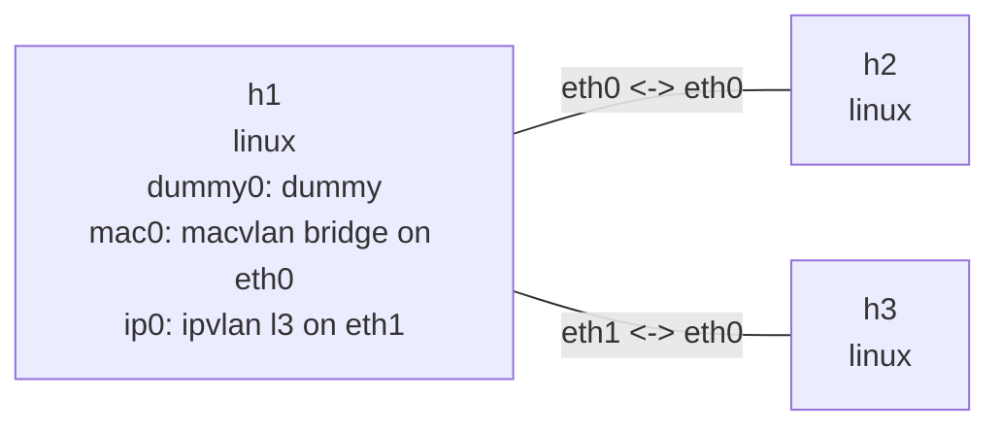

# Virtual devices

This lab creates three namespace-local interfaces on `h1`: a `dummy` device, a `macvlan` child
of `eth0`, and an `ipvlan` child of `eth1`. The two parent links are separate so the kernel can
create both device families without sharing one parent.

## Topology

```bash
nslab graph --format mermaid
```



## Run

```console
$ sudo nslab deploy
deployed topology: virtual-devices

$ sudo nslab inspect
status: deployed

NAME  KIND   STATUS    NAMESPACE
----  -----  --------  -----------------------------
h1    linux  matching  nslab-virtual-devices-h1-...
h2    linux  matching  nslab-virtual-devices-h2-...
h3    linux  matching  nslab-virtual-devices-h3-...

$ sudo nslab exec --node h1 -- /usr/sbin/ip -d link show dummy0
dummy0: <BROADCAST,NOARP,UP,LOWER_UP> mtu 1400 qdisc noqueue state UNKNOWN mode DEFAULT

$ sudo nslab exec --node h1 -- /usr/sbin/ip -d link show mac0
mac0: <BROADCAST,UP,LOWER_UP> mtu 1500 ... macvlan mode bridge

$ sudo nslab exec --node h1 -- /usr/sbin/ip -d link show ip0
ip0: <BROADCAST,UP,LOWER_UP> mtu 1500 ... ipvlan mode l3

$ sudo nslab destroy
destroyed topology: virtual-devices
```

`dummy0` is useful for stable local addresses and route targets. `mac0` has its own MAC address
and uses macvlan bridge mode; `ip0` shares the parent MAC and uses ipvlan layer-3 mode.

[View nslab.yaml](https://github.com/calcky/nslab/blob/main/examples/virtual-devices/nslab.yaml)
