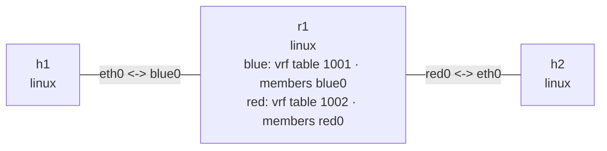

# VRF 实验

这个实验在 `r1` 的同一个 network namespace 内创建 `blue` 和 `red` 两个 VRF。
两侧使用完全相同的接口地址、下一跳和目标前缀，但分别进入路由表 1001 和 1002，
用于观察 Linux VRF 如何隔离重叠地址空间。

## 拓扑图

```console
$ nslab graph --format mermaid
flowchart LR
    n0["h1\nlinux"]
    n1["r1\nlinux\nblue: vrf table 1001 · members blue0\nred: vrf table 1002 · members red0"]
    n2["h2\nlinux"]
    n0 -- "eth0 <-> blue0" --- n1
    n1 -- "red0 <-> eth0" --- n2
```



以下为典型输出；接口索引、MAC 地址和 ICMP 时延会随运行变化。

## 部署

```console
$ sudo nslab deploy
deployed topology: vrf

$ sudo nslab inspect
status: deployed

NAME  KIND   STATUS    NAMESPACE
----  -----  --------  --------------------
h1    linux  matching  nslab-vrf-h1-...
r1    linux  matching  nslab-vrf-r1-...
h2    linux  matching  nslab-vrf-h2-...
```

## 查看 VRF 和成员关系

```console
$ sudo nslab exec --node r1 -- ip -d link show type vrf
<index>: blue: <NOARP,MASTER,UP,LOWER_UP> ... state UP ...
    vrf table 1001
<index>: red: <NOARP,MASTER,UP,LOWER_UP> ... state UP ...
    vrf table 1002

$ sudo nslab exec --node r1 -- ip -br link show master blue
blue0  UP  <mac> <BROADCAST,MULTICAST,UP,LOWER_UP>

$ sudo nslab exec --node r1 -- ip -br link show master red
red0   UP  <mac> <BROADCAST,MULTICAST,UP,LOWER_UP>
```

`blue0` 和 `red0` 都配置为 `10.0.0.1/24`。成员接口归属不同的 VRF，因此相同前缀
不会在同一张路由表中冲突。

## 对比两张路由表

```console
$ sudo nslab exec --node r1 -- ip -4 route show vrf blue
10.0.0.0/24 dev blue0 proto kernel scope link src 10.0.0.1
192.0.2.2 via 10.0.0.2 dev blue0 proto static

$ sudo nslab exec --node r1 -- ip -4 route show vrf red
10.0.0.0/24 dev red0 proto kernel scope link src 10.0.0.1
192.0.2.2 via 10.0.0.2 dev red0 proto static

$ sudo nslab exec --node r1 -- ip -4 route get 192.0.2.2
RTNETLINK answers: Network is unreachable
```

最后一个查询没有绑定 VRF，使用 main table，因此找不到目标；前两个查询虽然目标和
下一跳完全相同，却分别选择 `blue0` 和 `red0`。

## 验证重叠地址空间

```console
$ sudo nslab exec --node r1 -- ping -I blue -c 1 192.0.2.2
PING 192.0.2.2 (192.0.2.2) from 10.0.0.1 blue: 56(84) bytes of data.
64 bytes from 192.0.2.2: icmp_seq=1 ttl=64 time=<time> ms
1 packets transmitted, 1 received, 0% packet loss

$ sudo nslab exec --node r1 -- ping -I red -c 1 192.0.2.2
PING 192.0.2.2 (192.0.2.2) from 10.0.0.1 red: 56(84) bytes of data.
64 bytes from 192.0.2.2: icmp_seq=1 ttl=64 time=<time> ms
1 packets transmitted, 1 received, 0% packet loss
```

两个命令使用相同的源地址和目的地址，但 `-I blue` 到达 `h1`，`-I red` 到达 `h2`。

## 清理

```console
$ sudo nslab destroy
destroyed topology: vrf
```
