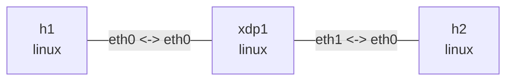

# Linux XDP 收发包实验

这个实验通过 `xdp1` 连接两个 IPv4 子网，在 `xdp1:eth0` 的 ingress 最前端依次加载
四个 eBPF section：

- `xdp/pass`：统计收到的帧并执行 `XDP_PASS`。
- `xdp/drop`：丢弃 ICMP Echo Request，其他帧继续进入协议栈。
- `xdp/tx`：交换 Ethernet/IP 地址，把 Echo Request 改成 Reply，并执行 `XDP_TX`。
- `xdp/redirect`：查询 Linux FIB、改写下一跳 MAC 和 TTL，并跨接口执行 `XDP_REDIRECT`。

为了让 veth 和不同 Linux 版本上的行为一致，命令使用 generic XDP（`xdpgeneric`）。
`XDP_TX` 仍然从 ingress XDP 程序触发，不是通用的 egress hook。

## 依赖

Ubuntu 上安装编译器、libbpf 头文件和观察工具：

```console
$ sudo apt-get install -y clang llvm libbpf-dev bpftool make
...

$ make
clang -I/usr/include/x86_64-linux-gnu -O2 -g -target bpf -Wall -Werror -c xdp_lab.c -o xdp_lab.o
```

## 拓扑图

```bash
nslab graph --format mermaid
```



## 部署

```console
$ sudo nslab deploy
deployed topology: xdp

$ sudo nslab inspect
status: deployed

NAME  KIND   STATUS    NAMESPACE
----  -----  --------  ---------------------
h1    linux  matching  nslab-xdp-h1-...
xdp1  linux  matching  nslab-xdp-xdp1-...
h2    linux  matching  nslab-xdp-h2-...
```

## XDP_PASS

加载 pass section；成功时 `ip link set` 不输出内容：

```console
$ sudo nslab exec --node xdp1 -- ip link set dev eth0 xdpgeneric object "$PWD/xdp_lab.o" section xdp/pass
(no output)

$ sudo nslab exec --node xdp1 -- ip -details link show dev eth0
... eth0 ... prog/xdp id <id> tag <tag> jited

$ sudo nslab exec --node h1 -- ping -c 2 10.40.1.254
PING 10.40.1.254 (10.40.1.254) 56(84) bytes of data.
64 bytes from 10.40.1.254: icmp_seq=1 ttl=64 time=<...> ms
64 bytes from 10.40.1.254: icmp_seq=2 ttl=64 time=<...> ms
2 packets transmitted, 2 received, 0% packet loss
```

统计 map 的 key 固定为 `0=RX`、`1=PASS`、`2=DROP`、`3=TX`、`4=REDIRECT`：

```console
$ sudo bpftool -jp map dump name nslab_xdp_stats
[
  {"key": 0, "value": <rx>},
  {"key": 1, "value": <pass>},
  {"key": 2, "value": 0},
  {"key": 3, "value": 0},
  {"key": 4, "value": 0}
]
```

## XDP_DROP

切换 section 会创建新的统计 map，因此计数从零开始：

```console
$ sudo nslab exec --node xdp1 -- ip link set dev eth0 xdpgeneric off
(no output)

$ sudo nslab exec --node xdp1 -- ip link set dev eth0 xdpgeneric object "$PWD/xdp_lab.o" section xdp/drop
(no output)

$ sudo nslab exec --node h1 -- ping -c 2 -W 1 10.40.1.254
PING 10.40.1.254 (10.40.1.254) 56(84) bytes of data.
2 packets transmitted, 0 received, 100% packet loss

$ sudo bpftool -jp map dump name nslab_xdp_stats
[
  {"key": 0, "value": <rx>},
  {"key": 1, "value": <arp-and-other>},
  {"key": 2, "value": 2},
  {"key": 3, "value": 0},
  {"key": 4, "value": 0}
]
```

ping 返回非零状态是本阶段的预期结果。ARP 等非 ICMP Echo Request 帧仍执行
`XDP_PASS`。

## XDP_TX

先加载 tx section，并记录 `h2` 内核 ICMP 计数器：

```console
$ sudo nslab exec --node xdp1 -- ip link set dev eth0 xdpgeneric off
(no output)

$ sudo nslab exec --node xdp1 -- ip link set dev eth0 xdpgeneric object "$PWD/xdp_lab.o" section xdp/tx
(no output)

$ sudo nslab exec --node xdp1 -- nstat -az IcmpInEchos IcmpOutEchoReps
#kernel
IcmpInEchos                  <before>
IcmpOutEchoReps              <before>

$ sudo nslab exec --node h1 -- ping -c 2 10.40.1.254
PING 10.40.1.254 (10.40.1.254) 56(84) bytes of data.
64 bytes from 10.40.1.254: icmp_seq=1 ttl=64 time=<...> ms
64 bytes from 10.40.1.254: icmp_seq=2 ttl=64 time=<...> ms
2 packets transmitted, 2 received, 0% packet loss

$ sudo nslab exec --node xdp1 -- nstat -az IcmpInEchos IcmpOutEchoReps
#kernel
IcmpInEchos                  <same-as-before>
IcmpOutEchoReps              <same-as-before>

$ sudo bpftool -jp map dump name nslab_xdp_stats
[
  {"key": 0, "value": <rx>},
  {"key": 1, "value": <arp-and-other>},
  {"key": 2, "value": 0},
  {"key": 3, "value": 2},
  {"key": 4, "value": 0}
]
```

ping 成功，但 `xdp1` 的 `IcmpInEchos` 和 `IcmpOutEchoReps` 不增加，说明 Echo Request
没有进入 `xdp1` 的 IPv4/ICMP 协议栈，Reply 由 XDP 程序直接构造并发回。

## XDP_REDIRECT

先卸载 tx section，并从 `xdp1` 主动访问 `h2`，为 FIB helper 准备 `eth1` 的邻居项：

```console
$ sudo nslab exec --node xdp1 -- ip link set dev eth0 xdpgeneric off
(no output)

$ sudo nslab exec --node xdp1 -- ping -c 1 10.40.2.2
PING 10.40.2.2 (10.40.2.2) 56(84) bytes of data.
64 bytes from 10.40.2.2: icmp_seq=1 ttl=64 time=<...> ms
1 packets transmitted, 1 received, 0% packet loss

$ sudo nslab exec --node xdp1 -- ip neigh show dev eth1
10.40.2.2 lladdr <mac> REACHABLE
```

只在 `xdp1:eth0` 加载 redirect section。Echo Request 由 XDP 跨接口转发，Echo Reply
从 `eth1` 进入后走普通 Linux IPv4 forwarding：

```console
$ sudo nslab exec --node xdp1 -- ip link set dev eth0 xdpgeneric object "$PWD/xdp_lab.o" section xdp/redirect
(no output)

$ sudo nslab exec --node h1 -- ping -c 2 10.40.2.2
PING 10.40.2.2 (10.40.2.2) 56(84) bytes of data.
64 bytes from 10.40.2.2: icmp_seq=1 ttl=63 time=<...> ms
64 bytes from 10.40.2.2: icmp_seq=2 ttl=63 time=<...> ms
2 packets transmitted, 2 received, 0% packet loss

$ sudo bpftool -jp map dump name nslab_xdp_stats
[
  {"key": 0, "value": <rx>},
  {"key": 1, "value": <arp-and-other>},
  {"key": 2, "value": 0},
  {"key": 3, "value": 0},
  {"key": 4, "value": 2}
]
```

key `4` 增加说明请求包执行了 `bpf_redirect()`。程序通过 `bpf_fib_lookup()` 获取
出口 ifindex 和下一跳二层地址，并像 IPv4 路由器一样把 TTL 减一、更新 IP 校验和。

## 清理

删除 namespace 会自动卸载 XDP 程序并释放未 pin 的 map：

```console
$ sudo nslab destroy
destroyed topology: xdp

$ make clean
rm -f xdp_lab.o
```
